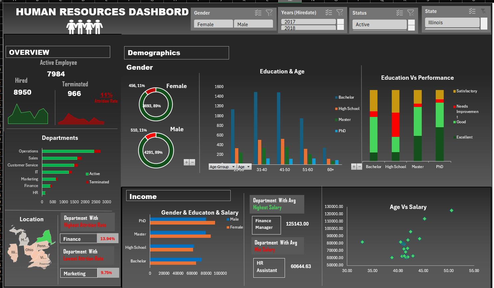

# Human_Resouces_Dashboard
📊 HR Management Dashboard (Excel)
Overview
This project is a Human Resources Analytics Dashboard built in Microsoft Excel. It transforms raw employee data into actionable insights using PivotTables, charts, and KPIs.

The dashboard helps HR teams track workforce trends, hiring patterns, and employee performance at a glance.

🔑 Features
Designed an end-to-end HR Analytics Dashboard in Excel, analyzing 8,950 employee records across 7 departments using pivot tables, slicers, and conditional formatting to surface workforce KPIs.
Built dynamic pivot tables to track a 10.79% attrition rate, segmenting terminations by department (Finance highest at 13.9%), gender, and tenure to identify high-risk employee cohorts.
Performed salary benchmarking analysis using MAX, MIN function, and grouped pivot reports, revealing a $17,781 pay gap between the highest (IT: $81,926) and lowest (HR: $64,145) compensated departments.
Engineered calculated fields and KPI cards to monitor performance distribution (42% Good, 17% Excellent) and education-linked salary trends, enabling data-driven HR decision-making.

🛠️ Skills Demonstrated
Excel (PivotTables, Power Pivot, Conditional Formatting, Charts)

Data Cleaning & Transformation

HR Analytics & KPI Development

Dashboard Design & Data Visualization

Business Intelligence Concepts

📂 Project Structure
Employee Data (Raw) → Source dataset

PivotTables → Summarized HR metrics

Charts → Visual representation of KPIs and trends

Dashboard → Final interactive view for decision‑making

## 📸 Dashboard Preview

📌 Insights
This dashboard enables HR managers to:

Monitor hiring and termination trends

Track workforce distribution by geography

Analyze employee demographics

Support data‑driven HR decisions

### KPI findings 
Attrition is worst in Finance (13.9%) 
IT pays the most ($81,926 avg), HR the least ($64,145)
PHD has the highest excellence rating (47.7% Excellent performers)
PhD holders earn 38% more than high school graduates. 
