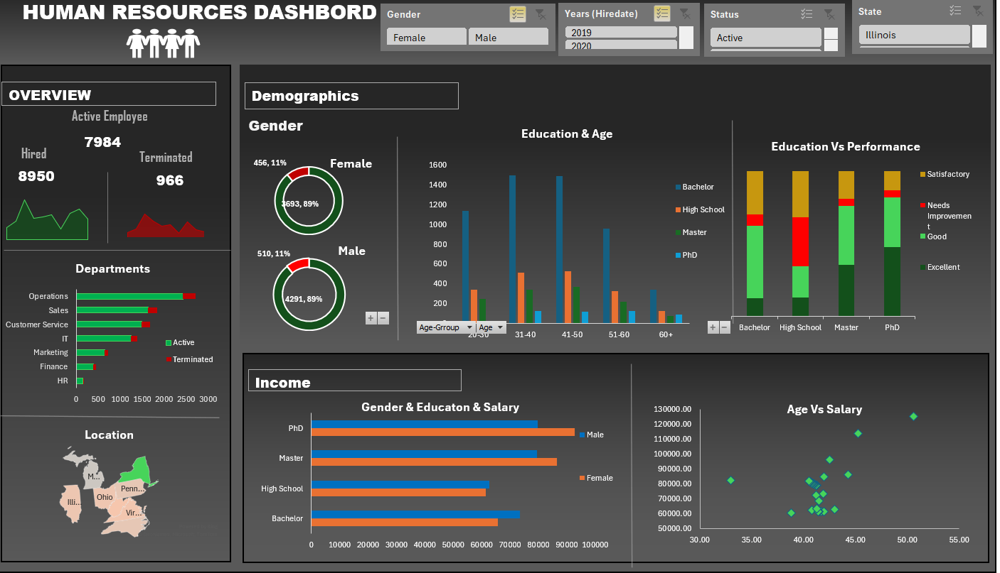

# Human_Resouces_Dashboard
📊 HR Management Dashboard (Excel)
Overview
This project is a Human Resources Analytics Dashboard built in Microsoft Excel. It transforms raw employee data into actionable insights using PivotTables, charts, and KPIs.

The dashboard helps HR teams track workforce trends, hiring patterns, and employee performance at a glance.

🔑 Features
PivotTables for dynamic summarization of employee data

Interactive charts (bar, line, scatter, map) for visual insights

Slicers & filters to explore data by gender, hire year, status, and location

KPIs for Active, Hired, and Terminated employees

Map chart to visualize workforce distribution across states and cities

Clean, professional Excel dashboard design

🛠️ Skills Demonstrated
Excel (PivotTables, Power Pivot, Conditional Formatting, Charts)

Data Cleaning & Transformation

HR Analytics & KPI Development

Dashboard Design & Data Visualization

Business Intelligence Concepts

📂 Project Structure
Employee Data (Raw) → Source dataset

PivotTables → Summarized HR metrics

Charts → Visual representation of KPIs and trends

Dashboard → Final interactive view for decision‑making

🚀 How to Use
Download the Excel file from this repository.

Open in Microsoft Excel (2016 or later recommended).

Use slicers/filters to interact with the dashboard.

Explore workforce insights across states, cities, and demographics.

## 📸 Dashboard Preview

📌 Insights
This dashboard enables HR managers to:

Monitor hiring and termination trends

Track workforce distribution by geography

Analyze employee demographics

Support data‑driven HR decisions
